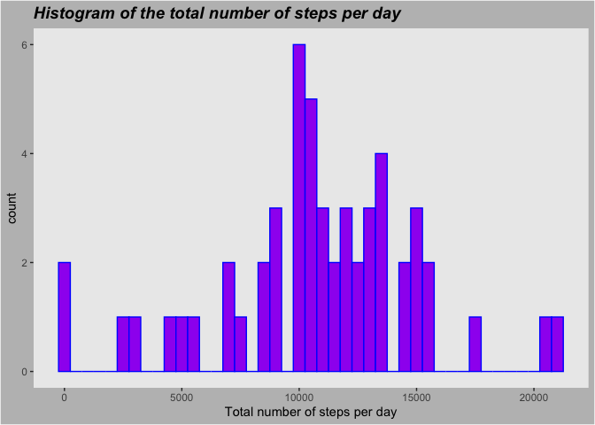
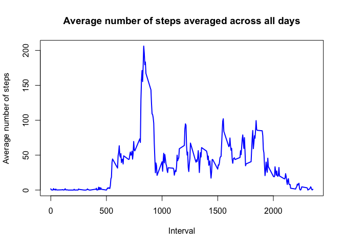
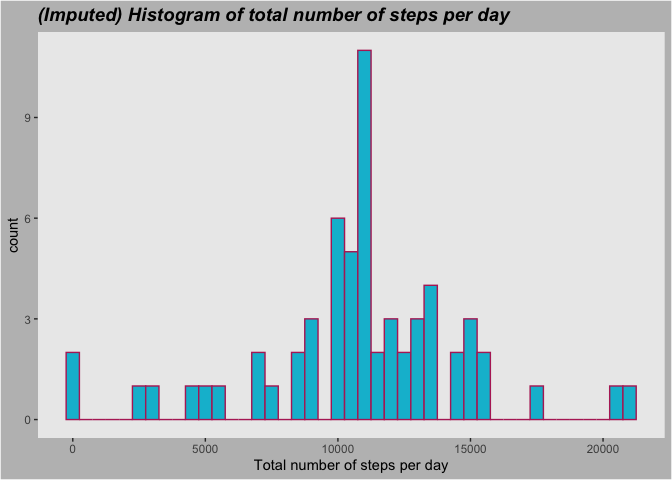
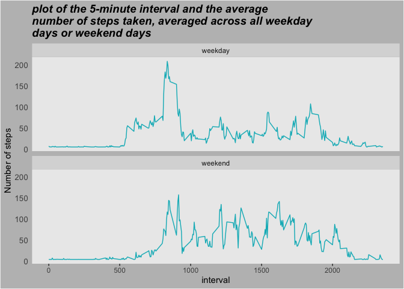

## Loading and preprocessing the data
#### Load the data read.csv

```r
library(dplyr)
```

```
## 
## Attaching package: 'dplyr'
```

```
## The following objects are masked from 'package:stats':
## 
##     filter, lag
```

```
## The following objects are masked from 'package:base':
## 
##     intersect, setdiff, setequal, union
```

```r
library(ggplot2)
library(plyr)
```

```
## ------------------------------------------------------------------------------
```

```
## You have loaded plyr after dplyr - this is likely to cause problems.
## If you need functions from both plyr and dplyr, please load plyr first, then dplyr:
## library(plyr); library(dplyr)
```

```
## ------------------------------------------------------------------------------
```

```
## 
## Attaching package: 'plyr'
```

```
## The following objects are masked from 'package:dplyr':
## 
##     arrange, count, desc, failwith, id, mutate, rename, summarise,
##     summarize
```

```r
# Leer los datos
data <- read.csv(unz("activity.zip", "activity.csv"))
```


## What is mean total number of steps taken per day?

**Keep only the complete rows**

```r
str(data)

# For this part of the assignment, you can ignore the missing values in the dataset.
data[complete.cases(data), ] # Keep only the complete rows
data_complete <- data[complete.cases(data), ] # Store the complete cases subset in a new data frame
```


```r
## hacer un vector de steps 
totalsteps <- tapply(data_complete$steps , data_complete$date, sum) 
#View(totalsteps)

## convertir el vector a data frame
df <- data.frame(date=names(totalsteps),sum=totalsteps)
#View(df)

# Histograma 
ggplot()+geom_histogram(data=df,
                        aes(x=df$sum),color="blue", fill="purple", binwidth=500)+
xlab("Total number of steps per day") +
        ggtitle("Histogram of the total number of steps per day")+
        theme(
                plot.title = element_text(color="black", size=14, face="bold.italic"),
                panel.grid = element_blank())+
        theme(plot.background = element_rect(fill = "gray"))
```

```
## Warning: Use of `df$sum` is discouraged. Use `sum` instead.
```

<!-- -->

**Calculate and report the mean and median of the total number of steps taken per day**


```r
# Calculate and report the mean and median of the total number of steps taken per day
mean <- mean(df$sum)
median  <- median(df$sum )
```

**The mean is 1.0766189\times 10^{4}  and  the median is 10765**


## What is the average daily activity pattern?
**1. Make a time series plot (i.e. type = “l”) of the 5-minute interval (x-axis) and the average number of steps taken, averaged across all days (y-axis).**

```r
## hacer un vector de interval 
totalinterval <- tapply(data_complete$steps , data_complete$interval , mean) 
##View(totalinterval)

## convertir el vector a data frame
ts<- data.frame(interval=names(totalinterval),mean=totalinterval)
```

**Make a time series plot (i.e. type = “l”) of the 5-minute interval**

```r
plot(ts$interval, ts$mean, type='l',col="blue",lwd=2,
     main="Average number of steps averaged across all days", xlab="Interval", 
     ylab="Average number of steps")
```

<!-- -->

**Which 5-minute interval, on average across all the days in 
the dataset, contains the maximum number of steps?**

```r
maxsteps <- max(ts$mean)
ts %>% filter(mean == maxsteps)
```

```
##     interval     mean
## 835      835 206.1698
```
## Imputing missing values

```r
sum(complete.cases(data))
```

```
## [1] 15264
```

```r
# Calculate and report the total number of missing values in the dataset
sum(!complete.cases(data))
```

```
## [1] 2304
```

```r
# Devise a strategy for filling in all of the missing values in the dataset. For example, you could use the mean
stepsmean<-mean(data$steps, na.rm=TRUE)
stepsmean
```

```
## [1] 37.3826
```

```r
data$steps[is.na(data$steps)]<-stepsmean

# Create a new dataset that is equal to the original dataset but with the missing data filled in.
newdataset <- data
```
**Make a histogram of the total number of steps taken each day and Calculate and report the mean and median total number of steps taken per day. Do these values differ from the estimates from the first part of the assignment? What is the impact of imputing missing data on the estimates of the total daily number of steps?**


```r
## hacer un vector de steps 
total_steps <- tapply(newdataset$steps , newdataset$date , sum) 
#View(totalsteps)

## convertir el vector a data frame
dataframe <- data.frame(date=names(total_steps),sum=total_steps)

# Histograma 
ggplot()+geom_histogram(data=dataframe,
                        aes(x=dataframe$sum),color="#b52b65", fill="#00bcd4", binwidth=500)+
xlab("Total number of steps per day") +
        ggtitle("(Imputed) Histogram of total number of steps per day")+
        theme(
                plot.title = element_text(color="black", size=14, face="bold.italic"),
                panel.grid = element_blank())+
        theme(plot.background = element_rect(fill = "gray"))
```

```
## Warning: Use of `dataframe$sum` is discouraged. Use `sum` instead.
```

<!-- -->

**Calculate and report the mean and median of the total number of steps taken per day**


```r
# Calculate and report the mean and median of the total number of steps taken per day
mean2 <- mean(dataframe$sum )
median2  <- median(dataframe$sum)
```

**The mean is 1.0766189\times 10^{4}  and  the median is 1.0766189\times 10^{4}**

## Are there differences in activity patterns between weekdays and weekends?

**1. Create a new factor variable in the dataset with two levels – “weekday” and “weekend” indicating whether a given date is a weekday or weekend day.**


```r
data$date <- as.Date(data$date)
data$type_day <- factor(ifelse (weekdays(data$date) %in%  c("Saturday","Sunday"),
  "weekend", "weekday"))
```

**2. Make a panel plot containing a time series plot (i.e. \color{red}{\verb|type = "l"|}type = "l") of the 5-minute interval (x-axis) and the average number of steps taken, averaged across all weekday days or weekend days (y-axis). See the README file in the GitHub repository to see an example of what this plot should look like using simulated data.**


```r
rm(mean)
steps_type_day <- aggregate(steps ~ interval + type_day, data=data, FUN=mean)

## plot
g<-ggplot(aes(interval, steps), data=steps_type_day)
g+geom_line(col = "#00b7c2") +
        facet_wrap(. ~type_day, nrow = 2)+
        ylab("Number of steps") +
        ggtitle("plot of the 5-minute interval and the average 
number of steps taken, averaged across all weekday 
days or weekend days")+
        theme(
                plot.title = element_text(color="black", size=14, face="bold.italic"),
                panel.grid = element_blank(),
                axis.text.y = element_text(size=10),
                axis.ticks.y = element_blank(),
                legend.direction = "horizontal",
                legend.position="top",
                legend.justification = "center")+
        theme(plot.background = element_rect(fill = "gray"))
```

<!-- -->

